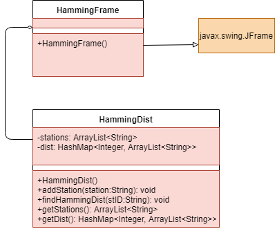

# Project-5
### Kiley Peters

  For this project I decided to create two classes to accomplish my goal. The classes are HammingDist and HammingFrame. 
  
  The HammingFrame class extends JFrame and is used to create the frame containing the GUI components, in order for the user to operate the station IDs. I used GridLayout to organize the GUI components.
  
  The HammingDist class is used to find the HammingDistance between the item selected in the JComboBox and all of the other station IDs. The list of station IDs is stored in an arraylist. HammingDist contains the method addStation for when a user adds a new station. It takes a string entered by the user in a JTextField and adds it as a new station to the stations ArrayList when the user interacts with the "add station" button from the HammingFrame. The JComboBox is then updated to show the new station. The actionListener for the addStation JButton in HammingFrame prevents duplicate stations from being added.
    In HammingDist, the method findHammingDist takes a string of a station that is currently selected on the JComboBox and compares it to each station in the stations arraylist. Each distance is recorded and added to a hashmap of arraylists. The hashmap allows for a list of Strings that can be called with integer keys 0-4. Using this hashmap, I can create a list of each station at a specific distance in the JTextArea and show the number of stations with that distance.
